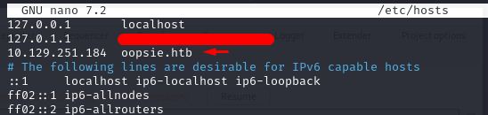

# Oopsie

### Difficulty:

Very Easy

### Tags:
PHP,
Web,
Custom Applications,
Session Handling,
Apache,
Reconnaissance,
Web Site Structure Discovery,
Cookie Manipulation,
SUID Exploitation,
Authentication bypass,
Clear Text Credentials,
Arbitrary File Upload,
Insecure Direct Object Reference (IDOR),
Path Hijacking.

### Tools used:

- Nmap - network scan
- Burpsuite Pro - proxy
- fuff - directory listing
- feroxbuster - directory listing (main)

Always refer to the help section if you are unsure of how to use the tool or are unfamiliar with how a flag works.

### Pro Tip:

> Edit the `/etc/hosts` file and add the IP of the machine as a known DNS entry. This way, you can use "http://lab_name.htb" instead of the IP address when accessing the machine or site.
> 

```bash
sudo /etc/hosts
```

> You just need to add the IP and lab name as follows: `<ip> <lab_name.htb>`
> 



## Tasks

- [ ]  TASK 1 - **With what kind of tool can intercept web traffic?**

A proxy is a tool that can intercept web traffic. In this case, we will be using Burpsuite Pro.


**Answer:** Proxy

- [ ]  TASK 2 - **What is the path to the directory on the webserver that returns a login page?**

We need to search for the login page. If this page has a login button, we're done. However, that was not the case.

> I highly recommend using the 'seclists' wordlist for directory listing.
> 

### Option 1:

 ffuf (it doesn't find recursive directories - so you will need to do various single directory search until you find what you're looking for).

```bash
ffuf -w /usr/share/wordlists/seclists/Discovery/Web-Content/raft-medium-directories-lowercase.txt  -e .php -u http://oopsie.htb/FUZZ -c -t 150
```


I will need to continue digging through the directories, like this:

```bash
ffuf -w /usr/share/wordlists/seclists/Discovery/Web-Content/raft-medium-directories-lowercase.txt  -e .php -u http://oopsie.htb**/cdn-cgi**/FUZZ -c -t 150
```

I won't show the output, but I believe you already got it.

### Option 2:

feroxbuster (it does find recursive directories - yeey)

```bash
feroxbuster -u [http://oopsie.htb](http://oopsie.htb/) -r
```


**Answer:** `cdn-cgi/login`

- [ ]  TASK 3 - **What can be modified in Firefox to get access to the upload page?**

It's obviously 'cookie'. But I need to find the right cookie, so I walked through the page ‘til I found something. 

I discovered that my user value is `2233` and my role is `guest`.


Those fields were also in the accounts page, value as ‘Access ID’ and role as ‘Name’.


**Answer: C**ookie

- [ ]  TASK 4 - **What is the access ID of the admin user?**

This is the upload page as guest user. 

**Note**: In this screenshot you can see that the rights needed to upload is `super admin`, but in this walkthrough we got the `admin` right and it works just fine. I noticed that there’s a user with `super admin` role, finding him will be your homework.


If we want to upload a file that can be used to obtain a reverse shell, we will need an admin role. Since we understand how the cookies work in this domain, we can attempt to identify who the administrator is.

In the accounts page, I noticed a number in the ID. It made me wonder if I could set it to a different number. Naturally, I started with '0'. However, I will only display the ID when it is equal to 1.


So, we just need to put those values in the cookie session and reload the page.


This is the upload page after the session hijacking, now we’ve got admin rights. 


**Answer:** 34322

- [ ]  TASK 5 - **On uploading a file, what directory does that file appear in on the server?**

We already know that the file appears in `uploads/` directory because we saw it previously in our directory listening.


**Answer:** `uploads/`

- [ ]  TASK 6 - **What is the file that contains the password that is shared with the robert user?**

So, this task is asking us to find a file shared with robert user. This means that we need to have access to his profile. For researchs purpose, I scanned every ID in accounts page and found some users, none was robert. I conclude that a robert user doesn’t exist in this site, and even if it existed where could I find a shared file or something?. Also, it was a php site with upload page it’s ********************************obviously******************************** a reverse shell as we suspected.

 I gonna use this revshell: [pentestmonkey/php-reverse-shell](https://github.com/pentestmonkey/php-reverse-shell/blob/master/php-reverse-shell.php)

********Note********: If it doesn’t accept .php format file there are plenty of formats you could try, like .php5 or something.

To use this reverse shell we just need to change these script session to set our IP Address and desired Port to listen.


This done, we can upload the file.


I started a netcat session listening in the port I choosed 

And opened the uploaded file in the browser, this action will make the server run the file and starts the connection.

.png)

### Bonus section:

We got the shell, but we need to upgrade the terminal because this one is pretty trashy. We’ll start trying the python one, it’s easier.

```bash
python3 -c "import pty;pty.spawn('/bin/bash')"
```


Okay, we got it! But this one is not good enough so we’re going to upgrade once again.

We’re going to `ctrl-z` to pause the process and upgrade the shell once again. It will be a more slow shell but you will be able to use arrow keys and some commands, like tab to autocomplete. This is the command you will need:

```bash
stty raw -echo && fg
```

**Note**: I highly recommend that you search for how `stty` works.

It will spawn the shell you had but with new configs and you’ll use this command to use `xterm` as terminal:

```bash
export TERM=xterm && reset
```

### End of bonus section.

Now we need to know what is the file that has the password, so the first thing we though was going to /var/www/html and see the page content. When we opened the `/cdn-cgi/login` we found a `db.php` file. We love database files! Voilà.


So now we can log in with robert user.

```bash
su robert
```


By this point, we can already get the user flag.

**Answer:** db.php

- [ ]  TASK 7 - **What executible is run with the option "-group bugtracker" to identify all files owned by the bugtracker group?**

If you don’t know the answer you can just google that one, I just did! Now as we know that the command is `find` we can run it as:

```bash
find / -group bugtracker 2>/dev/null
```

**Note:** Using `2>/dev/null` at the end will send errors and trash messages to `/dev/null` and will show only what we want. Just a tricky to speed up things. 


Okay, we find the bugtracker executable at `/usr/bin/bugtracker` .

**Answer:** find

- [ ]  TASK 8 - **Regardless of which user starts running the bugtracker executable, what's user privileges will use to run?**

If you want to know what are the privileges of the file you can just run a `ls -la` in the path.


**Answer:** root

- [ ]  TASK 9 - **What SUID stands for?**

If you don’t know just google it, theres nothing much to do. Yes, this thing needs a lot of googling.

**Answer:** set owner user id

- [ ]  TASK 10 - **What is the name of the executable being called in an insecure manner?**

We can run a `file` in bugtracker to see what is the file type, this gonna help us to take some decisions. We found out that it is a compiled file.


I tried to run some things with the bugtracker to see how it behaves. I noticed that he tried a `cat` in `/root/reports/<id>` . This is pretty suspicious.


I used `strings` to see what’s inside it and noticed that he really uses `cat` in `/root/reports/` path. And it does it with root privilege!!

**Note**: You can run a `cat` instead of `string` , but you’ll notice that compiled file are kinda unreadable. By using `file` command before, we found out that `strings` could help us in this mission.


I also tried to use some paths in the `id` field to see if it works and it does. Just nice to know.


I conclude that the idea is to use cat somehow to escalate to root user, I didn’t know that trick so I google it (thanks google).

I entered my `/tmp` and start my privilege escalation process.

I used `echo '/bin/sh' > cat` to create a file named ‘cat’ with the command to start a shell. I gave it execution privilege with `chmod +x cat` . And by the end, changed my relative path to `/tmp` with the command `export PATH=/tmp:$PATH`.  This will make my `cat` in `/tmp` run instead of the `cat` in the old path - the original one. So when we use `/usr/bin/bugtracker` it going to try to use `cat` to find the bug in `/root/reports/` and instead of search for the bug, it will run `/bin/sh` giving us a shell with the privilege of the file running - If we correctly remember, `root` .


For a better terminal, we can just use `/bin/bash -p` to spawn a bash with our settings with the root user.


**Answer:** cat

Now we just need to find the files that contain the flags. Usually in the `home/<user>/user.txt` and `home/root/user.txt`.

- [ ]  SUBMIT USER FLAG


- [ ]  SUBMIT ROOT FLAG


