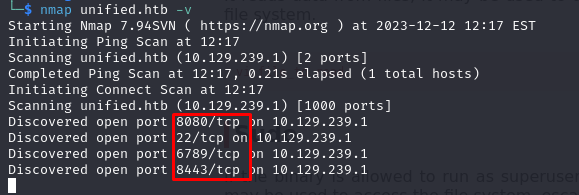

# Unified

### Difficulty:

Very Easy

### Tags:

Web, Vulnerability Assessment, Databases, Injection, Custom Applications, Outdated Software, MongoDB, Java, 
Reconnaissance, Clear Text Credentials, Default Credentials, Code Injection.

### Tools used:

- Nmap - network scan
- Metasploit -  it’s designed for exploiting vulnerabilities and general penetration testing
- mongo - open source NoSQL database management program
- hashcat - password cracking

Always refer to the help section if you are unsure of how to use the tool or are unfamiliar with how a flag works.

## Tasks

- [ ]  TASK 1 - **Which are the first four open ports?**

By utilizing the command `nmap -sV <ip>`, we can identify the ports in use.

**Answer:** 8080, 22, 6789, 8443

- [ ]  TASK 2 - **What is the title of the software that is running running on port 8443?**

Port 8443 is commonly utilized as an alternative port for HTTPS services. To explore, the initial step is to open the browser and attempt to access the HTTPS service on this port by navigating to `https://unified.htb:8443`.

We identified that the software in operation is UniFi. In an attempt to explore potential vulnerabilities, I searched for UniFi's default password. However, it turns out the default password was not misconfigured. Nevertheless, it's always crucial to assume the possibility of misconfigurations in such systems, as these flaws often pave the way to our goals.

**Answer:** UniFi

- [ ]  TASK 3 - **What is the version of the software that is running?**

That one is right in our face, I’m not going to waste time explaining it: 6.4.54.

**Answer:** 6.4.54

- [ ]  TASK 4 - **What is the CVE for the identified vulnerability?**

When attempting to gain access to a system with knowledge of the software and its version, a recommended initial step is to search for any known vulnerabilities associated with that version. In this instance, a quick Google search revealed an exploit with a Proof of Concept (PoC) and a corresponding CVE.

**Answer:** CVE-2021-44228

- [ ]  TASK 5 - **What protocol does JNDI leverage in the injection?**

I just googled it. If anyone reading this knows why the lab was asking for this particular information, please feel free to share your insights. I didn't use this information for any specific purpose; perhaps I didn't progress further because I opted to proceed using Metasploit, a comprehensive tool designed for exploiting vulnerabilities and general penetration testing.

**Answer:** LDAP

- [ ]  TASK 6 - **What tool do we use to intercept the traffic, indicating the attack was successful?**

I didn’t use that one too, but the answer was kind obvious for me.

**Answer:** tcpdump

- [ ]  TASK 7 - **What port do we need to inspect intercepted traffic for?**

As I didn’t use the LDAP I didn’t need that one too. But the port is 389, you can just google it.

**Answer:** 389

- [ ]  TASK 8 - **What port is the MongoDB service running on?**

This task is important as it alerts us to the requirement of having access to the server. While attempting the default port is an option, even if successful, it may not enable us to address the next challenge.

Thus, our focus shifts to gaining access to the server. As mentioned earlier, I used Metasploit, and I'll illustrate how I accomplished this.

**Note**: In real-life hacking scenarios, you'll encounter numerous challenges, each with potentially infinite solutions. There's no need to feel discouraged if you find yourself Googling for answers to questions you didn't know or didn’t need to achieve your goals. The diversity of challenges often calls for resourcefulness and learning on the fly.

I initiated Metasploit by running `msfconsole` and then conducted a search for the software we aim to exploit using `search <name_of_the_software>`. The output listed 13 possible known exploits, and after reading the descriptions, we deduced that the one titled 'UniFi Network Application Unauthenticated JNDI Injection RCE (via Log4Shell)' was precisely what we were looking for. To select it, we executed `use <number_of_the_exploit>`.

Once we selected our exploit, it's essential to understand how to use it. I strongly recommend reading up on how Metasploit works and how exploits are utilized within it. In this case, I used the `options` command to view the parameters that needed to be configured before executing the exploit. These parameters included 'LHOST' (my IP), 'SRVHOST' (the web server that would serve the exploit — also my IP in this case), and 'RHOST' (the target's IP). Once done , we simply wait for it to do the job. When the shell is obtained, you can run any command to verify its functionality.

**Note**: At this point, we can already get the user flag.

There are many methods to identify the port on which a service is running. I opted to use `ps aux` and searched for the 'mongodb' service or used `grep` to find the specific term. Alternatively, you could use `netstat`, which provides the status of active network connections.

Since this shell is quite limited, I decided to try upgrading it, beginning with Python.

Since Python or Python3 wasn't available, I had to attempt another upgrade command: `script /dev/null -c bash`, and bam — it worked! Just add a `export TERM=xterm && reset` command and everything was fine.

Okay, now that we discovered that this service is running on port 27117 we can connect to mongodb running `mongodb --port <port_you_found>` .

**Answer:** 27117

- [ ]  TASK 9 - **What is the default database name for UniFi applications?**

Now, we can begin searching for databases to find something useful for proceeding to gain root privileges. To do this, we'll need to use [basic MongoDB commands](https://www.mongodb.com/docs/). Let's initiate the process by looking for databases using `show dbs`.

I noticed that only one database had data, it was named ‘ace’. So we chose it running `use <database_name>` .

**Answer:** ace

- [ ]  TASK 10 - **What is the function we use to enumerate users within the database in MongoDB?**

Next, we should list the 'collections' to see what this database contains.

As there were numerous collections, I began noting down those with significant names such as 'accounts,' 'admin,' 'payment,' 'privilege,' and 'site.' Once it’s done, we should see the data inside each one. To accomplish this, we can use the command `db.<collection_name>.find()`.

Inside ‘admin’ collection I found something useful, a administrator access with somekind of encrypted password. Maybe we can work around this.

My initial thought was to identify the hash algorithm to attempt cracking it. It turned out to be a SHA512, which is notoriously challenging to crack. Nevertheless, I gave it a try by saving the hashed password to a file and using Hashcat with the command `hashcat -m 1800 -a 0 hash /usr/share/wordlists/rockyou.txt`.

Waiting for 1 hour and 20 minutes with no guarantee of success, I decided to abandon the attempt. Thank you, but no.

**Answer:** db.admin.find()

- [ ]  TASK 11 - **What is the function we use to update users within the database in MongoDB?**

I then considered that if I could write to it, I should be able to change its password. To achieve this, I used `mkpasswd -m sha-512 <new_password>` to generate a new password for the admin user.

I recorded the new password and attempted to update the user with the command `db.admin.updateOne({"_id":ObjectId("<objectId_of_administrator_user")}, {$set: {"x_shadow": "<new_password>"}})`. I discovered that `updateOne()` worked, although the task specifically called for the use of the `update()` function. Essentially, they perform the same basic operation.

After this, we should go to the login page and try our new combination.

Yas! It worked, we got access. Now we should find the ~~god damn~~ password for root - As a CTF beginner, at this point I was already tired. 

**Answer:** db.admin.update()

- [ ]  TASK 12 - **What is the password for the root user?**

The password wasn't that far — I just navigated through the pages until I found the SSH credentials for root.

Once discovered, we reached the good part — logged in and done.

**Answer: 👁️👅👁️**

- [ ]  SUBMIT USER FLAG

- [ ]  SUBMIT ROOT FLAG

